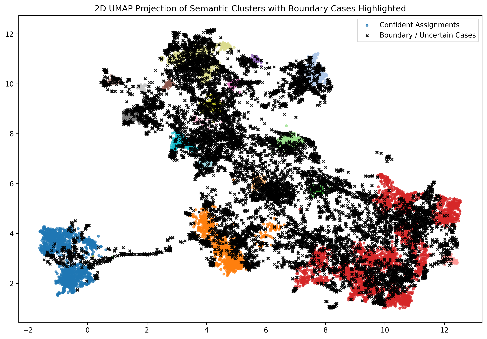

# Trademarkia Semantic Search & Dynamic Cache

This repository contains a lightweight, semantic search system built on the 20 Newsgroups dataset. It features an evidence-based fuzzy clustering engine, a custom-built semantic cache utilizing dynamic density thresholding, and a stateful FastAPI service.

📄 **[Read the Full System Architecture & Analysis Report (PDF)](report/report.pdf)**

## Architecture & Design Decisions

### 1. Fuzzy Clustering (HDBSCAN & UMAP)
Hard cluster assignments (like K-Means) fail to capture the nuance of documents that belong to multiple categories (e.g., a document about gun legislation belongs to both politics and firearms). This system uses **HDBSCAN** to output probabilistic distributions. The algorithm natively determines the optimal number of clusters based on spatial density, ensuring the cluster count is backed by mathematical evidence.


*Above: 2D projection demonstrating dense semantic clusters alongside highlighted boundary/uncertain cases (black 'x' marks).*

### 2. The Custom Semantic Cache (First Principles)
The cache layer is built from scratch without Redis, using an `OrderedDict` for O(1) LRU eviction. It optimizes lookup speed by partitioning queries based on their dominant cluster. To handle boundary cases (queries that sit between topics), the cache utilizes **Nucleus Sampling (Top-p)** to dynamically expand the search space across multiple cluster partitions.

### 3. The Tunable Decision: Dynamic Density Thresholding
A static similarity threshold (e.g., 0.85) assumes the vector space is uniform. It is not. A 0.85 distance in a dense, highly technical cluster (like computer hardware) is a false positive, while the same distance in a broad, sparse cluster (like politics) is a perfect match.

During the clustering phase, this system precomputes the geometric variance (density) of every cluster to determine a mathematically sound baseline threshold. 

$$\tau_i = \text{clip}\left(\mu(\text{sim}(C_i, \mathbf{v}_{centroid})) - 0.02, \text{ min=0.75, max=0.92}\right)$$

Where $\mu$ represents the mean cosine similarity of all documents in cluster $C_i$ to its geometric centroid. The thresholds are clipped to ensure usability: a floor of **0.75** prevents low-quality matches in sparse clusters, and a ceiling of **0.92** ensures the cache allows for natural paraphrasing in hyper-dense clusters.

The tunable parameter, `gamma` ($\gamma$), then scales this behavior globally to determine the final required threshold ($T_{req}$):
$$T_{req} = \min(0.95, \tau_i \cdot \gamma)$$

Adjusting `gamma` adjusts the system's overall sensitivity while preserving the relative geometric proportionality of the different semantic topics.

---

## Setup & Installation

**1. Create and Activate a Virtual Environment**
```bash
python -m venv venv
# On Windows:
.\venv\Scripts\activate
# On Mac/Linux:
source venv/bin/activate
```

**2. Install Dependencies**
```bash
pip install -r requirements.txt
```

**3. Initialize the Vector Database**
(Downloads the 20 Newsgroups dataset, computes embeddings, and builds the local ChromaDB)
```bash
python data_setup.py
```

**4. Train the Semantic Clusters & Cache Models**
(Trains UMAP/HDBSCAN, calculates dynamic cluster densities, and saves the .joblib models)
```bash
python clustering_engine.py
```

**5. Generate the Semantic Analysis Report (Optional)**
```bash
python cluster_analysis.py
```

**6. Start the FastAPI Server**
```bash
uvicorn main:app --host 0.0.0.0 --port 8000
```

## API Endpoints
Once running, the API is available at `http://localhost:8000`.

### POST /query
Submit a natural language query.

**Request (JSON)**

```json
{
  "query": "What is the latest news regarding the NASA space shuttle missions?"
}
```

**Example curl**

```bash
curl -X POST "http://localhost:8000/query" \
  -H "Content-Type: application/json" \
  -d '{"query":"What is the latest news regarding the NASA space shuttle missions?"}'
```

### GET /cache/stats
Retrieve current cache hit rates and capacity statistics.

**Example curl**

```bash
curl -X GET "http://localhost:8000/cache/stats"
```

### DELETE /cache
Safely flush the LRU cache.

**Example curl**

```bash
curl -X DELETE "http://localhost:8000/cache"
```


